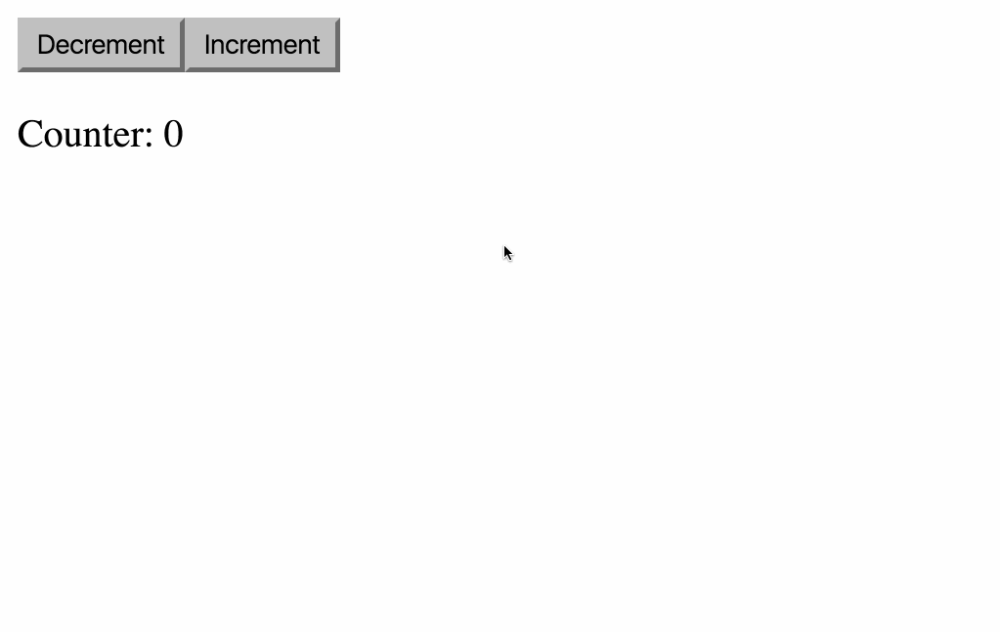

# Cycle.js DevTool for Chrome

A DevTool panel that renders a visualization of the dataflow graph between source streams and sink streams of your Cycle.js app in the inspected page.

# Usage

- **Alpha version.** In many cases it may not work. We need your help in these stages, please give *small* improvement suggestions, specially bug fixes. We also appreciate pull requests.
- **Only supports Cycle.js apps built with [xstream](http://staltz.com/xstream)**. In practice, this means apps written with xstream v2.3.0+, `xstream-run` v1.1.0+, and drivers that support "Cycle Diversity" (i.e., `streamAdapter` property attached to the driver function).

Install the plugin from the Chrome Web Store (link pending) or run `npm run dist` in this repository to compile the DevTool in the `dist` directory, then open `chrome://extensions/` in Chrome and `Load unpacked extension...` and point to the `dist` directory.

Enjoy :)
