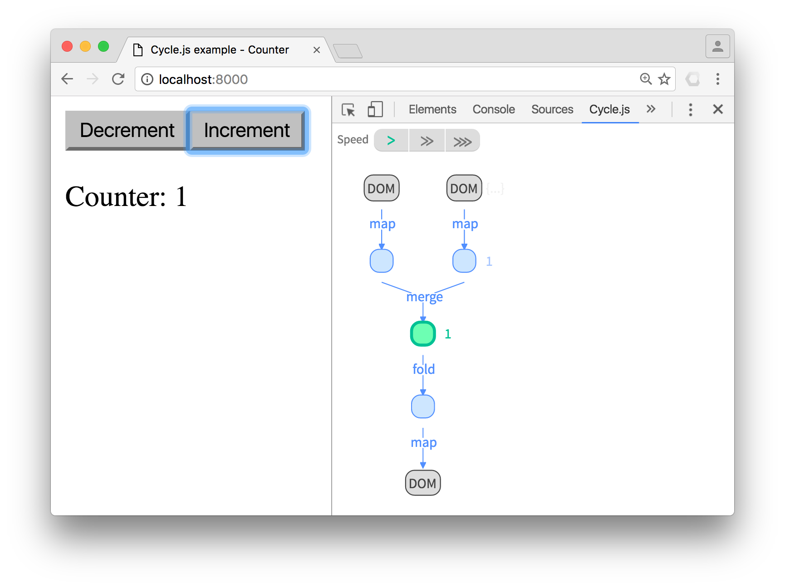

# Cycle.js DevTool for Chrome

A DevTool panel that renders a visualization of the dataflow graph between source streams and sink streams of your Cycle.js app in the inspected page.

For a thorough introduction to "Why" and "How" of this tool, watch this talk: [See the data flowing through your app](https://www.youtube.com/watch?v=R-GzJgEccEQ).

# Usage

This DevTool requires that your app is built using the following packages:

- `xstream` v6.1.x or higher
- `@cycle/run` v3.1.x or higher
- `@cycle/dom` v12.2.x or higher, if you are using it
- `@cycle/http` v10.2.x or higher, if you are using it

[Install the plugin from the Chrome Web Store](https://chrome.google.com/webstore/detail/cyclejs/dfgplfmhhmdekalbpejekgfegkonjpfp) or run `npm run dist` in this repository to compile the DevTool in the `dist` directory, then open `chrome://extensions/` in Chrome and `Load unpacked extension...` and point to the `dist` directory.

If the page is blank and your page is open under the `file://` protocol, you need to open Chrome Extensions settings `chrome://extensions/` and enable "*Allow access to file URLs*".
